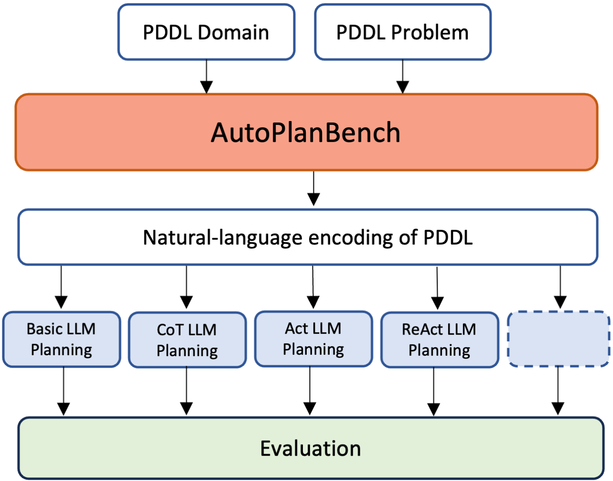

# AutoPlanBench

This repository contains the code for AutoPlanBench, a tool to convert PDDL domains and problems into natural language and to run different LLM planning approaches on them. 

Corresponding Paper: [AutoPlanBench: Automatically generating benchmarks for LLM planners from PDDL](https://arxiv.org/abs/2311.09830)


### Overview
This Readme contains the information needed to run the main parts of the project. More detailed information about the different options and configurations, the prompts, evaluation and additional scripts can be found in the [Wiki](https://github.com/minecraft-saar/LLM-planning-PDDL-domains/wiki).

Readme:
* [Requirements](https://github.com/minecraft-saar/LLM-planning-PDDL-domains/blob/main/README.md#requirements)
* [AutoPlanBench Overview](https://github.com/minecraft-saar/autoplanbench#autoplanbench-overview)
* [Running the Pipeline](https://github.com/minecraft-saar/autoplanbench#running-the-complete-pipeline)
* [Running individual steps](https://github.com/minecraft-saar/autoplanbench/blob/main/README.md#running-individual-steps)
    * [Generating domain descriptions, instances, etc.](https://github.com/minecraft-saar/autoplanbench#generating-the-domain-descriptions)
    * [Generating planning few-shot examples and configurations](https://github.com/minecraft-saar/autoplanbench#generating-planning-few-shot-examples)
    * [Running LLM planning](https://github.com/minecraft-saar/autoplanbench#running-llm-planning)
    * [Evaluation](https://github.com/minecraft-saar/autoplanbench#evaluation)

## Requirements
* `conda install pytorch torchvision torchaudio pytorch-cuda=11.7 -c pytorch -c nvidia`
* `pip install -e .` in the main folder of the repository
* download [fastdownward](https://www.fast-downward.org/Releases/22.12)
* get and compile [VAL](https://github.com/KCL-Planning/VAL)
* an OpenAI account (it is theoretically also possible to run other models such as llama or vicuna. However, we did not test these models on the tasks and cannot tell whether they successfully generate the formats required based on the prompts and few-shot examples from the current repository)

If running vicuna with bitsandbytes it might be necessary to manually install the transformers library from source.

Create a file `set_env.py` in the main directory and specify the environment variables for openai and the planning tools like this:
```
import os
def set_env_vars():
    os.environ['OPENAI_API_KEY'] = '[KEY]'
    os.environ['FAST_DOWNWARD'] = '[PATH]/fast-downward-22.12'
    os.environ['VAL'] = '[PATH]/VAL'
    os.environ['TOKENIZERS_PARALLELISM'] = 'false'

```

## AutoPlanBench Overview
<center>
    
</center>

## Required input files

A .pddl domain description and .pddl problem files for the domain are required as input files. Create a folder in the `data` directory with the domain name as folder name. Add the domain description to this folder and name it `domain.pddl`. The problem files should be placed in a subfolder called `orig_problems`. 

The `DATA_DIR` and `ORIG_INST_FOLDER` variables in [utils/paths.py](https://github.com/minecraft-saar/autoplanbench/blob/main/utils/paths.py) can be changed if another data directory or another name for the subfolder with the problem instances is used. Alternatively different directories can be specified when running run_autoplanbench.py

## Running the complete Pipeline

In order to run the complete AutoPlanBench pipeline including the generation of the natural language domain descriptions, all required files and running LLM planning and evaluation run:

`python run_autoplanbench.py -d [domain_name] -n [n_instances] --p-llm [planning_llm] --nl-llm [pddl2nl_llm]`

* `domain_name`: name of the domain; needs to match the name of the subfolder in the data folder where the domain file is located
* `n_instances`: number of instances that should be processed (set to number of instances to run planning on + 1 for few-shot example)
* `planning-llm`: the name of the LLM to use for the LLM planning and for translating the natural language output back to PDDL (in order to use two different models for planning and translation follow the individual steps approach below); e.g. 'gpt-4' or 'gpt-3.5-turbo'
* `nl-llm`: the name of the LLM to use for the generation of the natural language domain descriptions and the ReAct and CoT few-shot examples (currently only chat OpenAI models are supported here; to run different models the steps of the pipeline need to be run individually)

This will run the same experiments as reported in the paper with the same parameters. In order to change the parameters, the following additional arguments can be specified.

  Additional optional arguments:
  * `--app`: Tuple with the names of all planning approaches to run and evaluate. Defaults to ("basic", "cot", "react", "act")
  * `--data`: Path to the directory containing all data. Defaults to utils.paths.DATA_DIR
  * `--orig`: Path to the directory with the original instances. Defaults to utils.paths.DATA_DIR/domain_name/ORIG_INST_FOLDER
  * `--len-i`: Select only instances for which the length of the optimal plan is within the specified limits (inclusive). Default is (2, 20)
  * `--len-e`: Select the few-shot example by selecting randomly one of the instances with an optimal plan within the specified limits (inclusive). Default is (2, 5)
  * `--len-react`: Number of steps in the ReAct (and CoT) example; Default is 3
  * `--timeout`: Time (in sec) to let fast downward try to find an optimal gold plan. If no plan is found within this time limit the problem is treated as unsolvable, i.e. not considered. Default is 1200, i.e. 20 minutes. 
  * `--overwrite`: Whether to re-run the adaption and plan generation for instances for which they already exist. Default is False
  * `--desc`: Approach to create the precondition and effect descriptions: 'medium', 'long' or 'short'. Defaults to 'medium'. (see [here](https://github.com/minecraft-saar/autoplanbench/wiki/Generating-Natural-Language-Descriptions#composing-domain-descriptions-from-fragments) for mor details)
  * `--to-text`: Type of few-shot examples to use for creating the natural language domain descriptions: 'extended', 'annotated', 'full', 'simple; Defaults to 'extended' (see [here](https://github.com/minecraft-saar/autoplanbench/wiki/Generating-Natural-Language-Descriptions#prompts-and-examples-for-generating-the-natural-language-fragments) for more details)
  * `--ms-i`: Max number of steps the planning LLM is allowed to predict in the interactive approaches; defaults to 24
  * `--br-i`: Break limit for interactive approaches, i.e. if br-i consecutive predictions are not executable then stop; defaults to 5
  * `--ms-ni`: Max number of steps the planning LLM is allowed to predict in the non-interactive approaches; defaults to 1
  * `--br-ni`: Break limit for non-interactive approaches, i.e. if br-ni consecutive predictions are not executable then stop; defaults to 1
  

## Running Individual Steps 

### 1. Generating the domain descriptions, adapted instances, gold plans and translation examples

`python run_domain_setup.py -o [out_dir] --llm [llm]`

* `out_dir`: Path to the directory where all files for the specific domain are located 
* `llm`: Name of the LLM to use

Additional optional arguments:
* `--llm-type`: type of the llm to use, e.g. 'openai_chat'; if not specified, it is determined based on the llm name (see utils.helpers.get_llm_type)
* `-d`: Path to the domain.pddl file. Defaults to domain.pddl in the folder specified by -o.
* `-i`: Path to the directory with the original instance pddl files. Defaults to utils.paths.ORIT_INST_FOLDER in the folder specified by -o
* `-n`: number of instances that should be preprocessed and selected; If not set, then all instances from -i directory that are solvable and fulfill the length criterium are selected
* `--len`: Select only instances for which the length of the optimal plan is within the specified limits (inclusive). Default is (2, 20)
* `--timeout`: Time (in sec) to let fast downward try to find an optimal gold plan. If no plan is found within this time limit the problem is treated as unsolvable, i.e. not considered. Default is 1200, i.e. 20 minutes. 
* `--overwrite`: Whether to re-run the adaption and plan generation for instances for which they already exist. Default is False
* `--desc`: Approach to create the precondition and effect descriptions: 'medium', 'long' or 'short'. Defaults to 'medium'. (see [here](https://github.com/minecraft-saar/autoplanbench/wiki/Generating-Natural-Language-Descriptions#composing-domain-descriptions-from-fragments) for mor details)
* `--to-text`: Type of few-shot examples to use for creating the natural language domain descriptions: 'extended', 'annotated', 'full', 'simple; Defaults to 'extended' (see [here](https://github.com/minecraft-saar/autoplanbench/wiki/Generating-Natural-Language-Descriptions#prompts-and-examples-for-generating-the-natural-language-fragments) for more details)

**Generate only domain descriptions**<br>
Set `-n 0` in the command from above

**Generate adapted instances, gold plans and translation examples based on existing domain description**<br>
`python run_instance_setup.py -o [out_dir]`

Additional optional arguments:
* `-d`, `-n`, `--len`, `--timeout`, `--overwrite` as described above 
* `--nl`: Path to the file with the created NL descriptions. Defaults to domain_description.json in the folder specified by -o


### 2. Generate planning few-shot examples and configurations

**Generate few-shot examples and configurations**<br>

In order to generate the few-shot example files and configuration files for all approaches specified by utils.paths.APPROACHES the following command can be used:

`python run_setup_exp_files.py -d [domain_name] --ex-id [example_id] --llm [llm]`

* `domain_name`: name of the domain
* `example_id`: ID of instance that gets used as few-shot example and should be excluded from the experiment.
* `llm`:  name of the LLM to use for generating the thoughts and that is used as both the planning and nl-to-pddl translation LLM (to use two different models, the configuration files need to be created / changed manually)

Additional optional arguments:
* `--thoughts`: Whether thoughts should be generated for react and cot examples. Otherwise only templates with placeholders for the thoughts are generated. Defaults to True
* `--rl`: Number of steps in the ReAct example. If not set or set to None then the specified example is not shortened. Otherwise the ReAct and CoT few-shot example is shortened to the last --rl steps. 
* `--react-exd`: Path to the file with the nl description of the example domain. Defaults to utils.paths.THOUGHT_GEN_EXAMPLE_DOMAIN
* `--react-exf`: Path to the file with the react interaction example. Defaults to utils.paths.THOUGHT_GEN_EXAMPLE_FILE.
* `--ms-i`: Max number of steps the planning LLM is allowed to predict in the interactive approaches; defaults to 24
* `--br-i`: Break limit for interactive approaches, i.e. if br-i consecutive predictions are not executable then stop; defaults to 5
* `--ms-ni`: Max number of steps the planning LLM is allowed to predict in the non-interactive approaches; defaults to 1
* `--br-ni`: Break limit for non-interactive approaches, i.e. if br-ni consecutive predictions are not executable then stop; defaults to 1
* `--enc`: Type of the encoding. Should be 'planbench' if LLM planning is run on the domain encodings from [PlanBench](https://github.com/karthikv792/LLMs-Planning/tree/main/plan-bench). Otherwise should be 'automatic'. Defaults to 'automatic'.
* `--dd`: Path to the directory with the data; defaults to utils.paths.DATA_DIR


**Generating few-shot examples**<br>

In order to generate the few-shot examples for a specific domain and specific approach run:

`python llm_planning/create_few_shot_examples.py --dir [data_dir] --pref [prefixes] --version [approach]`

* `data_dir`: Path to the directory with the files of the specific domain
* `prefixes`: Tuple of the prefixes that should be added to the beginning of the input and output few-shot examples. First prefix is for the input and second one for the output. Is usuall ("", "") for the interactive approaches and (["STATEMENT"], ["PLAN"]) for the non-interactive ones
* `approach`: The approach for which the few-shot examples get generated ('basic', 'act', 'cot', 'react' or 'state_reasoning')

Additional optional arguments:
* `--ex-id`: The ID of the instance that should be converted into a few-shot example. If not set then all instances are converted into a few-shot example.
* `--enc` and `--rl` as above

**Note**: for the react and cot approach, this function only generates templates, i.e. with placeholders for the thoughts. In order to generate thoughts using an LLM and add them run the llm_planning/fill_thought_examples.py script

`python fill_though_examples.py --template [template] --nl-domain [nl_domain] --ex-domain [ex-domain] --ex-react [ex-react] --out [out] --llm [llm]`
* `template`: path to the template file generated by the create_few_shot_examples script
* `nl_domain`: path to the file with the natural language description of the domain for which the example is generated
* `ex-domain`: path to the file with the natural language description of the domain that is used as few-shot example for the thoughts generation
* `ex-react`: path to the few-shot example for the thoughts generation
* `out`: path to the output file for the react example, the path to the output file for the cot example is derived by replacing 'react' by 'cot'
* `llm`: the LLM got use for generating the thoughts

**Generate planning configurations**<br>

In order to generate the configuration files for all 5 implemented approaches for a specific domain the following command can be used:

`python configs/create_config.py -d [domain_name] --llm [llm]`

* `domain_name`: name of the domain
* `llm`: name of the LLM to use as both the planning and nl-to-pddl translation LLM (to use two different models, the configuration files need to be created / changed manually)

Additional optional arguments:
* `--d-dir`: Path domain directory. Defaults to utils.paths.DATA_DIR/domain_name
* `--ex-id`: ID of instance that gets used as few-shot example and should be excluded from the experiment. If set to None, all instances from --d-dir/adapted_instances are included in the experiments. Defaults to None.
* `--enc`: Type of the encoding. Should be 'planbench' if LLM planning is run on the domain encodings from [PlanBench](https://github.com/karthikv792/LLMs-Planning/tree/main/plan-bench). Otherwise should be 'automatic'. Defaults to 'automatic'.
* `--ms-i`, `--br-i`, `--ms-ni`, `--br-ni`, `--enc` as above


### 3. Running LLM planning

`python run_planning.py --config [config] --few-shot-id [example_id]`

* `config`: Path to the planning configuration file
* `example_id`: ID fo the few-shot example to use. Will be selected from the few-shot example directory of the specific approach; For example, if the approach is 'basic' and example_id is X then the few-shot example is read from the file DATA_DIR/domain_name/few_shot_examples_basic/basic_examples_instance-X.json

**Saving the prompts**<br>
In order to save the P-LLM and T-LLM prompt for a specific problem instance in a separate file run: <br>
`python save_prompts.py --config [config] --few-shot-id [example_id] --pl-out --tr-out`<br>
where `config` and `few-shot-id` are as described above and `pl-out` and `tr_out` are the paths to the file where the P-LLM and the T-LLM prompt gets saved respectively.


### 4. Evaluation
See the [evaluation Readme](https://github.com/minecraft-saar/autoplanbench/blob/main/evaluation/README.md#evaluation).
